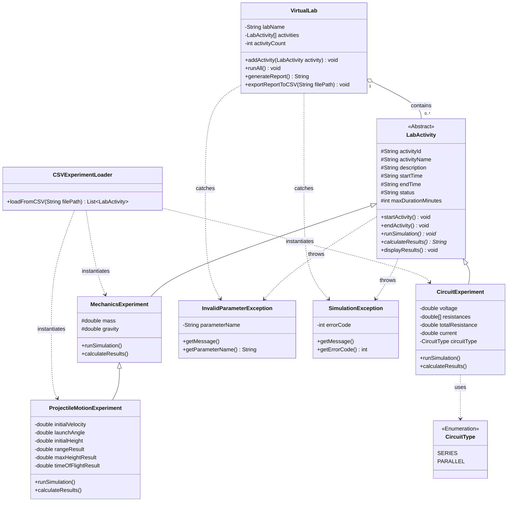

# P6tem: Virtual Lab for Physics Experiments

P6tem (pi - six - tem) is a Java console-based application that simulates and
manages a set of physics experiments: mechanics (projectile motion) and circuits,
using OOP principles with CSV import/export and custom exception handling.

## Classes
- `InvalidParameterException`, `SimulationException` - custom checked exceptions
- `CircuitType` - enum (`SERIES`, `PARALLEL`)
- `LabActivity` - abstract base class
- `MechanicsExperiment` - extends `LabActivity` (weight = mass x gravity)
- `ProjectileMotionExperiment` - extends `MechanicsExperiment`
- `CircuitExperiment` - extends `LabActivity` (Ohm's Law, series/parallel)
- `CSVExperimentLoader` - reads `experiments.csv` and builds the experiments
- `VirtualLab` - runs every experiment, generates the report, exports it to CSV
- `Main` - entry point

## UML



## How to Run
Requires Java 14 or newer. From the project root (so `experiments.csv` is found):

```bash
javac -d bin src/main/java/*.java
java -cp bin Main
```

Results print to the console and are exported to `session_report.csv` (regenerated every run).

## experiments.csv Format
The first row is a header, and columns are matched by name, so their order doesn't matter.

```
type,activityId,activityName,description,maxDurationMinutes,mass,gravity,initialVelocity,launchAngle,initialHeight,voltage,resistances,circuitType
```

| Type | Columns to fill |
|---|---|
| `MECHANICS` | `mass`, `gravity` |
| `PROJECTILE` | `mass`, `gravity`, `initialVelocity`, `launchAngle`, `initialHeight` |
| `CIRCUIT` | `voltage`, `resistances`, `circuitType` |

- Leave unused columns blank, but keep every row at the full column count.
- Separate multiple resistances with `;` (for example `10;20;30`).
- No commas inside `activityName` or `description`.
- `circuitType` must be exactly `SERIES` or `PARALLEL`.
- Invalid rows are skipped with a warning; experiments that fail validation or simulation are marked `ERROR` in the report.

## Status
Complete: all classes implemented and tested against the sample `experiments.csv`.

## Team
Built by:
Tan, Sean Handrea
Tiria, Kenjhi
Villanueva, Arwin Luigi
Zablan, Alsher Vinz
for Final Project in 6OOP: Ma'am Carisma Caro | 1st Semester